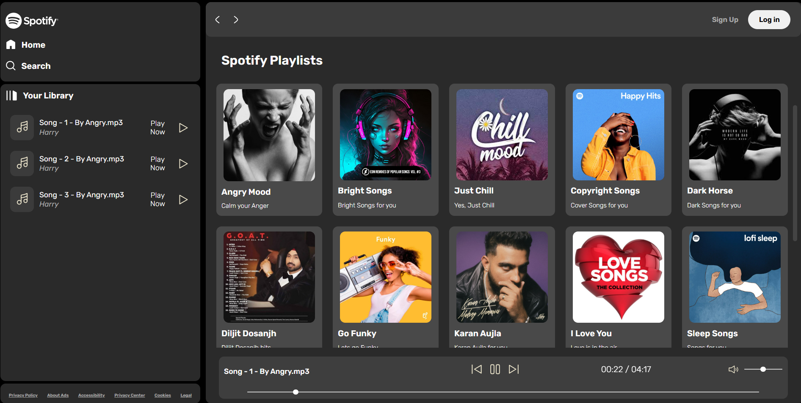

# Music Web Application

A frontend music web application that allows users to explore and play their favorite tracks.

## Features

- **Music Playback**: Play and pause songs.
- **Libarary Updation**: Update songs in the sidebar according to the selected library.
- **User-Friendly Interface**: Easy navigation and smooth user experience.
- **Responsive Design**: Optimized for various devices.

## Demo



## Installation

1. **Clone the Repository**:

   ```bash
   git clone https://github.com/pritish-ranjan-sahoo/music_web_app.git
   navigate music_web_app > spotify > index.html
   ```

2. **Open the Application**:

   Open the `index.html` file in your preferred web browser.

## Usage

1. **Select Library and Play Music**:
   - Use the Libraries to play songs.
   - select songs from the sidebar which shows all the songs present inside that playlist.
   - Click on a song to start playback.

2. **Responsive Experience**:
   - Enjoy a seamless experience across all devices.

## Technologies Used

- **HTML5**
- **CSS3**
- **JavaScript (ES6+)**


## Acknowledgements

- Inspired by spotify music streaming platforms.